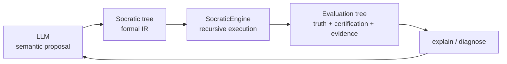
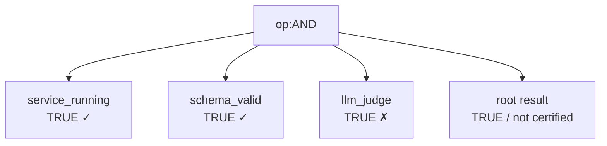
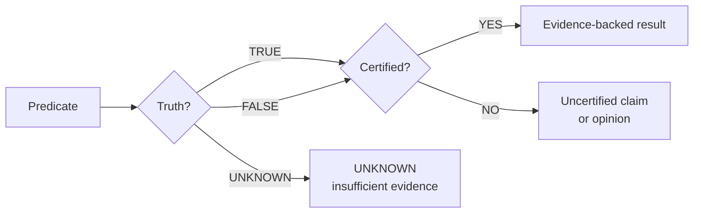
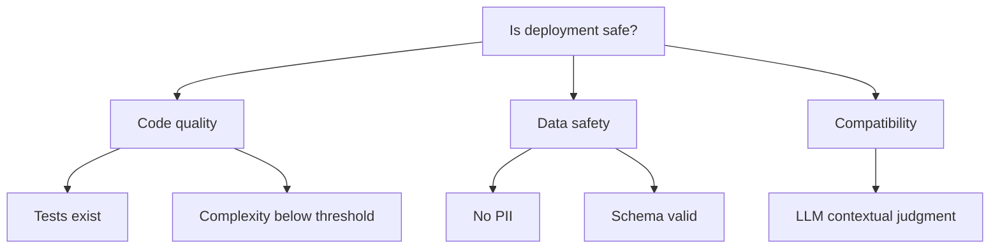
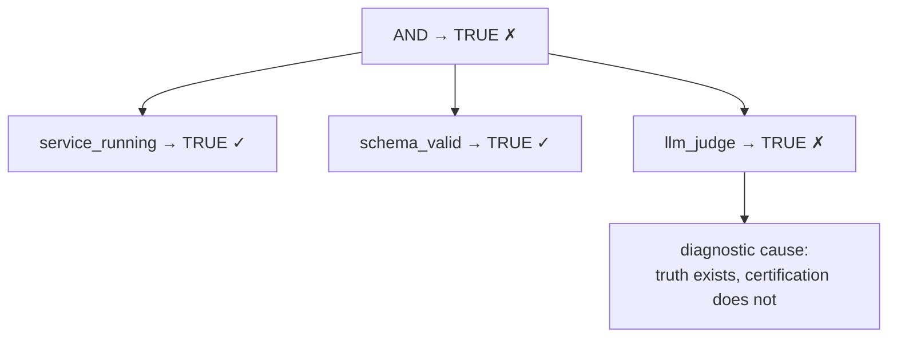
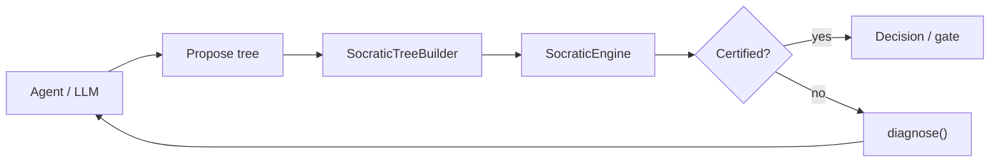
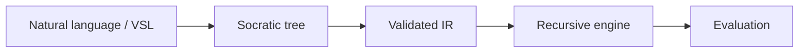
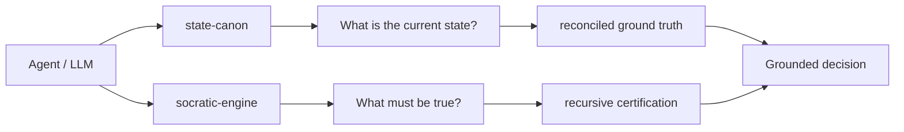

# socratic-engine — externalized reasoning for AI agents


> **Don't ask the language model to hold the whole recursion. Give the recursion a substrate.**

`socratic-engine` is a model-agnostic reasoning substrate for AI agents: a recursive evaluator for **trivalent logical trees** with an explicit separation between **truth**, **certification**, and **evidence**.

The engine is deliberately small. It does not try to make an LLM "smarter". It gives the model a formal structure in which complex questioning can be proposed, executed recursively, inspected, and diagnosed **outside the model's token-generation loop**.

**Status:** v0.2.1 published on PyPI — core engine, VSL tree parser, CLI, MCP bridge, dialectical operator, pragmatic predicates, caching, rate limiting, CI (pytest 3.10–3.12 + coverage gate at 90%), benchmarks, and a 189-test suite at 100% statement coverage are working. The official state-canon bridge ([`bridge_statecanon.py`](./socratic_engine/bridge_statecanon.py)) and end-to-end examples are in the repo HEAD but **not yet in the PyPI 0.2.1 release** — pending 0.2.2. The broader claim — that externalizing recursive structure improves reliability on tasks that exceed a model's implicit recursive reasoning capacity — is an experimental hypothesis, not a proclamation.

---

## The bet

LLMs are excellent at generating hypotheses, decomposing problems, interpreting language, and proposing strategies.

They are less reliable when they must **implicitly execute a deep recursive reasoning process while simultaneously maintaining all of its premises, branches, dependencies, and intermediate states in context**.

The bet here is simple:

> **Let the model propose the questions. Let a deterministic substrate execute the recursion.**

The model does not have to remember the entire reasoning process. The tree does.



This creates a division of labour:

| Component | Responsibility |
|---|---|
| **LLM** | formulate hypotheses, propose questions, interpret results |
| **Tree / IR** | preserve recursive structure explicitly |
| **SocraticEngine** | execute logic deterministically |
| **Predicates** | perform domain-specific atomic checks |
| **Evaluation** | preserve truth, certification, evidence, context |
| **diagnose()** | identify the branches that prevented certification |

The central boundary is:

> **The LLM proposes. The engine validates and executes. The LLM does not certify.**

---

## What it is

At its core, the engine evaluates trees composed of:

- `AND`
- `OR`
- `NOT`
- `XOR`
- `IMPLIES`
- `DIALECTICAL_AND`
- registered predicates
- boolean literals

The logical result is **trivalent**:

```text
TRUE
FALSE
UNKNOWN
```

But truth is not the same thing as certification.

Every evaluation can additionally carry:

```text
truth
certified
evidence
source
context
metadata
children
```

So the result of a recursive evaluation is itself a **recursive evaluation tree**.



A model may produce a plausible answer. That answer can be represented as `TRUE`.

It does **not** follow that the system is allowed to certify it.

---

## Why three values?

A certification system must distinguish:

```text
FALSE
```

from:

```text
UNKNOWN
```

If the system cannot establish a proposition because data is missing, a check timed out, or the subject of the question is absent, returning `FALSE` silently converts **lack of evidence into evidence of falsity**.

`socratic-engine` therefore treats indeterminacy as a first-class result:

```text
TRUE      → the proposition evaluated true
FALSE     → the proposition evaluated false
UNKNOWN   → the proposition could not be decided
```

This matters particularly at routing boundaries.

For example:

```text
TYPE = ""
question: "Does TYPE start with VSL-?"

→ UNKNOWN
```

not:

```text
→ FALSE
```

The discipline is:

> **No subject, no judgment.**

---

## Truth is not certification

This is the epistemic boundary at the centre of the engine.



For example:

```python
@engine.register("llm_judge")
def llm_judge(question, evidence, **kwargs):
    return PredicateResult(
        truth=Truth.TRUE,
        certified=False,
        evidence=evidence,
        source="llm",
    )
```

The LLM can say:

```text
TRUE
```

without being allowed to say:

```text
CERTIFIED
```

A deterministic predicate can instead return:

```python
PredicateResult(
    truth=Truth.TRUE,
    certified=True,
    evidence={"pid": 1234},
    source="pgrep",
)
```

The distinction is intentional.

---

## Recursive questioning

The tree is not merely a data structure for the final answer.

It is the **externalized representation of the questioning process**.

A complex question can be decomposed:



The model can generate this structure.

The engine recursively evaluates it.

The model receives the resulting structure rather than having to simulate the complete recursion itself.

That is the architectural experiment.

---

## A minimal tree

```python
from socratic_engine import SocraticEngine

engine = SocraticEngine()

tree = {
    "op": "AND",
    "children": [
        {"predicate": "type_prefix", "args": ["$type", "VSL-"]},
        {"predicate": "ctx_has", "args": ["$ctx", "status"]},
    ],
}

result = engine.evaluate(
    tree,
    {
        "type": "VSL-LANG-01",
        "status": "validated",
    },
)

print(result.truth)
print(result.certified)
print(result.explain())
```

The engine can evaluate arbitrary nesting because the same contract is applied at every level.

---

## Registering domain predicates

The engine contains no domain-specific reasoning beyond its small built-in predicate set.

You add the atomic questions:

```python
from socratic_engine import PredicateResult, Truth

@engine.register("service_running")
def service_running(name: str, **kwargs):
    # Replace with a real structural check.
    if name == "cache":
        return PredicateResult(
            truth=Truth.TRUE,
            certified=True,
            evidence={"pid": 1234},
            source="pgrep",
        )

    return PredicateResult(
        truth=Truth.FALSE,
        certified=True,
        evidence={"service": name, "running": False},
        source="pgrep",
    )
```

The engine does not need to know what a service is.

It only knows:

```text
predicate → PredicateResult
```

That keeps the reasoning substrate domain-agnostic.

---

## A complete example

```python
from socratic_engine import SocraticEngine, Truth, PredicateResult

engine = SocraticEngine()


@engine.register("service_running")
def service_running(name: str, **kwargs):
    if name == "cache":
        return PredicateResult(
            truth=Truth.TRUE,
            certified=True,
            evidence={"pid": 1234, "uptime": "2h 15m"},
            source="pgrep",
        )

    return PredicateResult(
        truth=Truth.FALSE,
        certified=True,
        evidence={"service": name},
        source="pgrep",
    )


@engine.register("llm_judge")
def llm_judge(question: str, evidence: str, **kwargs):
    # In production: call the model here.
    return PredicateResult(
        truth=Truth.TRUE,
        certified=False,
        evidence=evidence,
        source="llm",
        metadata={"question": question},
    )


tree = {
    "op": "AND",
    "children": [
        {
            "predicate": "service_running",
            "args": ["cache"],
        },
        {
            "predicate": "llm_judge",
            "kwargs": {
                "question": "Is this deployment safe?",
                "evidence": "Traffic is currently below 45%",
            },
        },
    ],
}

result = engine.evaluate(tree)

print(result.explain())
```

The important result is not merely the boolean answer.

The evaluation preserves the distinction:

```text
service_running → TRUE  [✓]
llm_judge       → TRUE  [✗]

root            → TRUE  [✗]
```

The claim can be true according to the predicate while still being **uncertified**.

---

## Operator semantics

The engine implements:

| Operator | Logical semantics | Certification |
|---|---|---|
| `AND` | all branches must be true | all children relevant to the result must be certified |
| `OR` | at least one branch must be true | one true child must be certified |
| `NOT` | invert one proposition | child must be certified |
| `XOR` | exactly one true branch | children must be certified |
| `IMPLIES` | antecedent → consequent | antecedent and consequent must be certified when relevant |
| `DIALECTICAL_AND` | contradiction is not rejection — a certified TRUE/FALSE conflict yields `UNKNOWN` (certified), with thesis/antithesis in metadata | in conflict: all children certified (the contradiction itself is a fact); without conflict: all children certified |

The distinction matters for diagnosis.

For example:

```text
A OR B
```

does not require both A and B to succeed.

If A is already certified `TRUE`, B is not a failure merely because it is `FALSE` or `UNKNOWN`.

The diagnostic engine follows the semantics of the operator rather than simply collecting every non-TRUE leaf.

---

## Diagnosis: reason backwards from failure

`evaluate()` tells you what happened.

`diagnose()` asks:

> **Which branch actually prevented certification?**



This is deliberately an **inverse trace**.

Instead of returning only:

```text
BLOCKED
```

the engine can return the structural cause:

```text
llm_judge
truth = TRUE
certified = FALSE
source = llm
```

That makes the result useful to an agent attempting another iteration.

```text
PROPOSE
   ↓
BUILD
   ↓
EVALUATE
   ↓
DIAGNOSE
   ↓
REFINE
   ↓
EVALUATE
   ↓
...
```

---

## The agent loop

The intended architecture is not:

```text
LLM → answer
```

but:



The important recursion is therefore not necessarily inside the language model.

It can occur at the **system level**:

```text
LLM
 ↓
tree
 ↓
engine
 ↓
evaluation
 ↓
diagnosis
 ↓
LLM
 ↓
refined tree
 ↓
engine
 ↓
...
```

This is the mechanism this project is intended to make explicit and testable.

---

## VSL as a reasoning representation

The repository includes a small recursive parser for declared:

```text
socratic("NAME") = { ... }
```

blocks.

That allows the same questioning structure to exist as a language-level artifact rather than only as Python dictionaries.



This is important for the broader VSL/VSF work:

> the language can describe **how a question is decomposed**, while the engine provides the execution semantics.

The tree therefore acts as an intermediate representation between semantic generation and deterministic execution.

---

## Builder: the boundary before execution

`SocraticTreeBuilder` exists as a deliberate gate between an external proposer — including an LLM — and the evaluator.

It recursively validates:

- operators;
- operator arity;
- registered predicates;
- nested children;
- arguments and keyword arguments.

```text
LLM proposes
     │
     ▼
┌──────────────────┐
│ SocraticTreeBuilder │
│ structural gate  │
└────────┬─────────┘
         │ valid
         ▼
   SocraticEngine
```

An unknown predicate is rejected before execution.

A malformed `NOT` or `IMPLIES` is rejected before execution.

The model is therefore not trusted to produce executable logic merely because the syntax looks plausible.

---

## Built-in predicates

The engine currently ships with deterministic predicates for structural classification and pragmatic behaviour:

| Predicate | Question | Missing subject |
|---|---|---|
| `type_glob` | does TYPE match a glob? | `UNKNOWN` |
| `type_prefix` | does TYPE start with a prefix? | `UNKNOWN` |
| `type_regex` | does TYPE match a regex? | `UNKNOWN` |
| `type_has` | does TYPE contain a token? | `UNKNOWN` |
| `doc_has_status` | does a document declare a status? | evaluated from document |
| `ctx_has` | does context contain a key/value? | `UNKNOWN` |
| `trend_up` | is a time series growing sustainably (min_delta, noise guard)? | `UNKNOWN` |
| `trend_down` | is a time series falling sustainably (min_delta, noise guard)? | `UNKNOWN` |
| `feedback_loop` | does a topology have a closed cycle (length ≥ 2) through target? | `UNKNOWN` |

Registering custom predicates is the intended extension point.

Costly predicates can be wrapped with `@cached(ttl=...)` — hits are marked `metadata.cached=True` (historical evidence, not a fresh measurement), `UNKNOWN` is never cached, and `engine.cache.clear()` forces re-verification.

---

## MCP bridge

The engine can be exposed through the **Model Context Protocol**.

Install the optional dependency:

```bash
python -m pip install -e ".[mcp]"
```

Run the server:

```bash
python -m socratic_engine.mcp_server
```

The current bridge exposes:

| Tool | Purpose |
|---|---|
| `socratic_build` | validate a proposed reasoning tree |
| `socratic_evaluate` | execute a tree against context |
| `socratic_diagnose` | return inverse failure traces |
| `socratic_canon_query` | (opt-in) query state-canon through the registered bridge |

The MCP layer is intentionally thin.

It includes a per-tool sliding-window rate limiter (`SOCRATIC_MCP_RATE_LIMIT`, default 100 calls / `SOCRATIC_MCP_RATE_WINDOW`, default 60s): a rate-limited call returns error `-32029` with `retry_after_s` — a transient signal, not a rejection.

The reasoning contract remains in the engine.

---

## Bridge to `state-canon` (official)

The official integration between the engine and **state-canon** lives in
[`socratic_engine/bridge_statecanon.py`](./socratic_engine/bridge_statecanon.py).

**Division of labor** (from the "Relationship to `state-canon`" section):

> **state-canon grounds the agent in what is observed.**
> **socratic-engine constrains how claims about that state are evaluated.**

The bridge registers four predicates on any `SocraticEngine`, all prefixed
`canon_` — they query the provider (the reconciled ground truth, *observed*)
and convert the result into certified evidence:

| Predicate | Question it answers |
|---|---|
| `canon_query(domain, filter)` | Is there at least one record matching the filter? |
| `canon_matches(domain, filter, expected)` | Do the records match the expected fields exactly? |
| `canon_field_equals(domain, filter, field, expected)` | Does a specific field equal the expected value? |
| `canon_drift(domain, filter, declared_field, observed_field)` | Have declared and observed drifted apart? |

`filter` and `expected` accept either a JSON string or a Python dict.

Semantics follow the engine's epistemology (R9 — no silent concession):

- **TRUE / FALSE** are returned **certified** (structural evidence exists).
- **UNKNOWN** is returned **uncertified** when there is no evidence — no
  records, an unknown filter field, a missing field, or an unparseable
  filter. No inventing, no silent routing to `else_home`.

```python
from socratic_engine import SocraticEngine
from socratic_engine.bridge_statecanon import StateCanonBridge

eng = SocraticEngine()
bridge = StateCanonBridge(eng, provider)   # provider: state_canon.StateProvider

ev = eng.evaluate({"op": "DIALECTICAL_AND", "children": [
    {"predicate": "canon_field_equals",
     "args": ["services", '{"name": "api"}', "declared_active", True]},
    {"predicate": "canon_field_equals",
     "args": ["services", '{"name": "api"}', "observed_active", True]},
]})
# declared TRUE, observed FALSE → certified conflict → UNKNOWN certified,
# with metadata.thesis / metadata.antithesis — the dialectical operator
# turns the drift into productive indetermination, not a false binary.
```

The MCP server accepts an optional `provider` (opt-in, R6): when set, the
`canon_*` predicates are registered and `socratic_canon_query` appears in
`tools/list`.

---

## CLI

Evaluate a JSON tree directly:

```bash
socratic-engine eval-tree tree.json --doc-type THEORY-VC-01
```

A successful response contains the structured decision together with its explanation and diagnostic information.

This makes the same engine usable from:

- agent write-time gates;
- commit hooks;
- scripts;
- CI/CD;
- MCP clients;
- other VSM/VSF components.

---

## Install

### From PyPI (v0.2.0)

```bash
pip install socratic-engine
```

### With MCP support

```bash
pip install "socratic-engine[mcp]"
```

### From source

```bash
git clone https://github.com/rm-w3kufe/socratic-engine.git
cd socratic-engine

python3 -m venv .venv
.venv/bin/python -m pip install -e .
```

### Run the tests

```bash
python3 -m pytest tests/ -q
```

The current repository snapshot passes:

```text
189 passed
```

at 100% statement coverage (CI gates at 90%; uncovered lines are
documented `# pragma: no cover` defensive branches — see the rationale
inline in the source).

(includes integration tests with `state-canon`, available when that
package is installed or reachable at `~/state-canon-mcp`)

---

## Repository layout

```text
socratic-engine/
├── README.md
├── ROADMAP.md
├── pyproject.toml
├── LICENSE
├── benchmarks/
│   └── benchmark.py        # deep/wide trees, cache speedup, diagnose
├── docs/
│   ├── ONTOLOGY.md         # epistemic model
│   ├── ARCHITECTURE.md     # how it fits together (code-faithful)
│   └── EXAMPLES.md         # executable use cases
├── socratic_engine/
│   ├── __init__.py
│   ├── engine.py           # trivalent evaluator + certification + diagnosis
│   ├── tree.py             # builder + VSL parser + tree routing
│   ├── cli.py              # command-line interface
│   ├── mcp_server.py       # MCP / JSON-RPC bridge + rate limiter
│   └── bridge_statecanon.py # official state-canon bridge (opt-in)
└── tests/
    ├── test_engine.py
    ├── test_mcp_server.py
    ├── test_cli.py
    ├── test_bridge_statecanon.py
    └── test_state_canon_integration.py
```

---

## Relationship to `state-canon`

`socratic-engine` and `state-canon` solve different parts of the same larger problem.



A useful way to state the division is:

> **state-canon grounds the agent in what is observed.  
> socratic-engine constrains how claims about that state are evaluated.**

`state-canon` answers questions such as:

```text
"What is actually running?"
"Has reality drifted from the declared state?"
```

`socratic-engine` answers questions such as:

```text
"Given these premises, what follows?"
"Which branch prevents certification?"
"Is there enough evidence to pass this gate?"
```

Together they can form a larger agent-governance loop:

```text
          observed reality
                 │
                 ▼
           state-canon
                 │
          grounded context
                 │
                 ▼
        socratic-engine
                 │
       certified evaluation
                 │
                 ▼
             decision
```

The important boundary remains the same:

> **The thing that produces a claim should not be the sole authority that certifies the claim.**

---

## Measured, not proclaimed

The central research question is empirical:

> **Does externalizing recursive reasoning into an executable tree improve reliability on tasks where the same model performs poorly when recursion is kept implicit?**

This repository is therefore better treated as an experimental instrument than as a claim that the problem has already been solved.

A useful comparison is:

```text
CONTROL
LLM
 ↓
recursive problem
 ↓
answer


EXTERNALIZED
LLM
 ↓
reasoning tree
 ↓
SocraticEngine
 ↓
evaluation / diagnosis
 ↓
LLM
 ↓
answer
```

The measurements that matter include:

- logical correctness;
- premise retention;
- contradiction rate;
- recursive depth successfully handled;
- recovery after a failed branch;
- number of model iterations;
- token cost;
- deterministic reproducibility.

A result that saves tokens while producing worse decisions is not a win.

---

## Design principles

### R9 — no silent concession

If a proposition cannot be decided, return `UNKNOWN`.

Do not silently convert missing evidence into a false proposition or route an undecidable branch through an implicit fallback.

### R10 — opinion is not evidence

An LLM can generate a judgment.

It cannot make that judgment certified merely by asserting it.

### R10.1 — the LLM proposes, the engine executes

The external model may propose a reasoning tree.

The builder validates its structure.

The engine executes the recursion.

### Domain agnosticism

The engine does not contain the meaning of the domain.

Predicates do.

### Traceability

Every recursive evaluation remains inspectable.

The result is not just a scalar; it is a tree.

### Diagnosis

Failure should produce a useful next question, not merely a blocked state.

---

## What this is not

`socratic-engine` is:

- **not** an agent framework;
- **not** a prompt-engineering framework;
- **not** a vector database;
- **not** a replacement for an LLM;
- **not** a claim that symbolic logic alone produces intelligence.

It is a **reasoning substrate**.

Its purpose is narrower:

> **externalize recursive logical structure so that a language model can participate in complex reasoning without being solely responsible for executing the recursion.**

---

## Roadmap

### v0.1.x — core

- [x] trivalent logic
- [x] truth / certification separation
- [x] recursive evaluation
- [x] inverse diagnostic trace
- [x] safe tree builder
- [x] VSL recursive tree parser
- [x] CLI
- [x] MCP bridge
- [x] deterministic built-in predicates
- [x] unit tests

### v0.2.x — maturation

- [x] CI workflow (pytest 3.10–3.12 + coverage + CLI smoke + MCP job)
- [x] coverage > 90% (now 100%; CI gates at 90%)
- [x] integration tests with `state-canon`
- [x] performance benchmarks
- [x] richer examples and architecture documentation
- [x] dialectical operator for legitimate contradictions
- [x] temporal / pragmatic predicates
- [x] caching and rate limiting for expensive predicates
- [x] published on PyPI (v0.2.0)
- [ ] official state-canon bridge + end-to-end examples (Claude Code, OpenCode)

### v0.3.x — formal extension

- [ ] paraconsistent logic
- [ ] contextual / frame semantics
- [ ] stakeholder participation graphs
- [ ] formal VSM → Socratic Engine derivation

The roadmap is intentionally open: the next features should be driven by failures observed in the experimental programme, not by feature accumulation.

---

## Going deeper

- **[docs/ONTOLOGY.md](./docs/ONTOLOGY.md)** — the epistemic model: truth, certification, UNKNOWN, operator semantics, and the LLM boundary.
- **[docs/ARCHITECTURE.md](./docs/ARCHITECTURE.md)** — how the modules fit together, written against the code.
- **[docs/EXAMPLES.md](./docs/EXAMPLES.md)** — executable use cases: classification, deploy gates, diagnosis, dialectics, caching, rate limiting.
- **[ROADMAP.md](./ROADMAP.md)** — current development programme (tracked as [issue #1](https://github.com/rm-w3kufe/socratic-engine/issues/1)).
- **[benchmarks/benchmark.py](./benchmarks/benchmark.py)** — performance numbers (deep/wide trees, cache speedup, diagnose).
- **[tests/](./tests/)** — executable specification of the current semantics.

---

## Lineage

`socratic-engine` was extracted from the broader VSM/VSF governance work as a standalone reasoning component.

Its role is deliberately narrower than the surrounding system:

```text
VSM / VSF
   │
   ├── state and governance
   │
   ├── canonical observation
   │
   └── recursive epistemic evaluation
                     │
                     ▼
              socratic-engine
```

The extraction is intentional: the recursive evaluation contract is useful independently of any single domain, agent framework, or language model.

---

## License

Code: **Apache-2.0** — see [LICENSE](./LICENSE).
